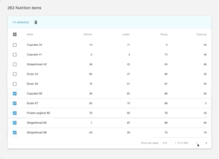

# material-ui-mst-table

> Material-ui Table controlled by Mobx State Tree



[](https://www.npmjs.com/package/material-ui-mst-table) [](https://standardjs.com)

## Features
⋅⋅1 Multi select using SHIFT+CLICK -> Event over pagination pages
..2 Bulk Actions -> Actions that can be triggered for one or more selected items
..3 Row Actions -> Actions that apear for each row
..4 Filtering system for filtering the shown content
..5 Custom cell renderers -> for example -> edit cell callout

## Install

```bash
npm install --save material-ui-mst-table
```

## Usage

```jsx
import React from "react";
import {
  TableModel,
  MstMuiTable,
  columnBuilder,
  Data,
  RowAction,
  BulkAction
} from "material-ui-mst-table";

class Example extends React.Component {
  constructor(props) {
    super(props);
    this.tableModel = TableModel.create({
      orderBy: "timestamp",
      bulkActions: [BulkAction.create({ type: "delete" })],
      rowActions: [RowAction.create({ type: "edit" })],
      columnList: {
        columns: [
          columnBuilder("displayName", "Name", value => value),
          columnBuilder("timestamp", "Date", value => value),
          columnBuilder("size", "Size", value => value, { numeric: true })
        ]
      }
    });

    this.updateDataProvider(this.props.submittedItems);
  }

  componentDidUpdate(prevProps) {
    this.updateDataProvider(this.props.submittedItems);
  }

  updateDataProvider = items => {
    const dataList = [];
    items.forEach(item => {
      const { id, displayName, size, timestamp } = item;
      dataList.push(
        Data.create({
          id,
          fieldNames: {
            displayName,
            timestamp,
            size
          }
        })
      );
    });
    this.tableModel.updateDataProvider(dataList);
  };

  handleRowAction = (data, action) => {
    switch (action.type) {
      case "edit":
        console.log(data);
        break;
      default:
        break;
    }
  };

  handleBulkAction = action => {
    switch (action.type) {
      case "delete":
        // delete the data items that can be found on this.tableModel.selected
        break;
      default:
        break;
    }
  };

  render() {
    return (
      <MstMuiTable
        tableModel={this.tableModel}
        onRowAction={this.handleRowAction}
        onBulkAction={this.handleBulkAction}
      />
    );
  }
}
```

## License

MIT © [bjeld](https://github.com/bjeld)
